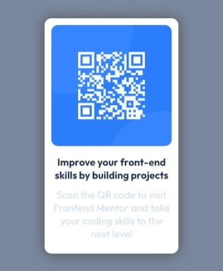

# Frontend Mentor - QR code component solution

This is a solution to the [QR code component challenge on Frontend Mentor](https://www.frontendmentor.io/challenges/qr-code-component-iux_sIO_H). Frontend Mentor challenges help you improve your coding skills by building realistic projects. 

## Table of contents

- [Overview](#overview)
  - [Screenshot](#screenshot)
- [My process](#my-process)
  - [Built with](#built-with)
  - [What I learned](#what-i-learned)
  - [Continued development](#continued-development)
  - [Useful resources](#useful-resources)
- [Author](#author)
- [Acknowledgments](#acknowledgments)

## Overview

This project was built with accessibility in mind. Did research on suitable tags and attributes that would be accessible to screen readers. The project made provision for two screen widths but i added a 720px width to make it responsive at that scrren size. Decided to use main and section tags instead of div tag beacasue divs and spans annot be read by screen readers.

### Screenshot




## My process
- Took notes of the requirements of the project and research needed.
- Research accessibility features for the tags to be used.
- Research further on grid, flex-box and css position property.
- Wrote down the structure and classes i may need.
- Created my folder structure.
  - qr-code-component
    - css
    - images
    - screenshots
- Created the html.
- Created the css.
  - Imported the Outfit font from google fonts.
  - Used Flex-Box to center the qr-code-component.
  - Added box shadow just for try.
  - Created the media query for mobile devices.
- Took screenshots.    

### Built with

- Semantic HTML5 markup
- CSS custom properties
- Flexbox
- Microsoft Edge
- VS-Code

### What I learned

- The <div> and <span> tags are not html semantic tags meaning they cannot be read by screen readers.
- Learned the correct application of the <header>, <main>, <section> tags.
- Even if i do not place the paragraphs in their own section i could still style them to achieve the same style.
- I learned and practiced some grid layout styles.
- learned how to import a font and also download the font to use it offline in my project(s).
- Learned to use the HSL colour poperty and the meaning.
    - H -> Hue
    - S -> Saturation
    - L -> Light
- All the values applicable to the Box-Shadow property.
- Finally learned a little bit of Emmet which i used. Boy! it was great.

### Codes i'm proud of

```css
body {
    height: 100vh;
    background-color: hsl(220, 15%, 55%);
    display: flex;
    justify-content: center;
    align-items: center;
    overflow: hidden;
}
```

### Continued development

- Improve my understanding and use of the HSL colour property.
- The border-radius property made me resaerch into fancy border designs and shapes. I have to do more practice with taht.
- Edit images before use in my project(s). I never edited my images before using.
- Learn more accessiblity features for the most commonly used tags.

### Useful resources

- [HSL Color property](https://www.w3schools.com/colors/colors_hsl.asp#:~:text=HSL%20stands%20for%20hue%2C%20saturation%2C%20and%20lightness.%20HSL,is%20red%2C%20120%20is%20green%2C%20240%20is%20blue.) - This helped in understanding HSL.
- [Accessibility features](https://www.w3schools.com/accessibility/accessibility_semantic_elements.php) - This helped with understanding accessibility features.
- Some great tutorials by 'Traversy Media' and 'Web Dev Simplified'
  - [CSS Grid layout](https://www.youtube.com/watch?v=0xMQfnTU6oo)
  - [CSS Flex-box layout](https://www.youtube.com/watch?v=3YW65K6LcIA)
  - [Emmet tutorial](https://www.youtube.com/watch?v=V8vizNQKtx0)

## Author
- Frontend Mentor - [@blue-mariposa](https://www.frontendmentor.io/profile/blue-mariposa).

## Acknowledgments

- Thanks to Frontend Mentor for the guide(s).

-Thanks to Jessica of 'Coder Coder'. Learned something on how to plan and research for a project or task mfrom her video 'Build a light/dark dashboard' - [Link](https://www.youtube.com/watch?v=iL4irerdGdU).
